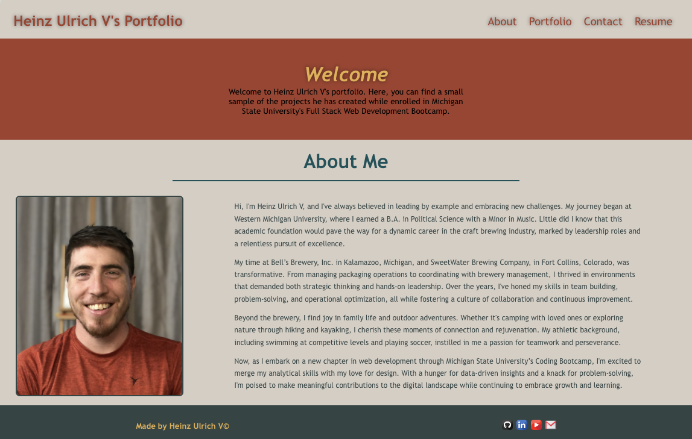
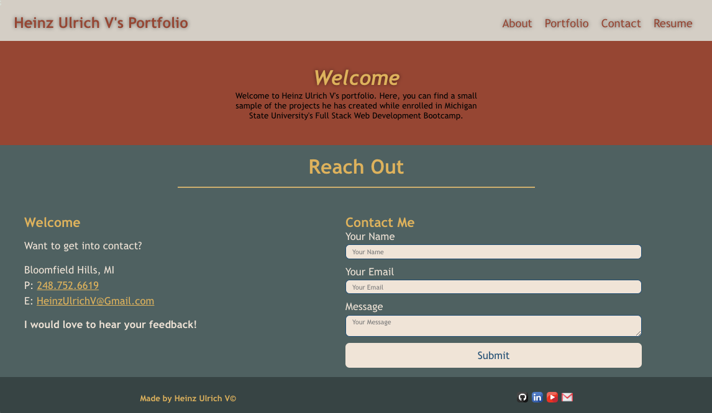

# Heinz Ulrich V Portfolio

[Heinz Ulrich V Portfolio](https://heinzulrichv.netlify.app/) 

## Description

The portfolio website you're about to explore represents the culmination of my journey as a web developer, showcasing my skills and projects developed using cutting-edge technologies. Built with React, this single-page application not only serves as a platform to present my work but also demonstrates my proficiency in modern web development.

Upon loading the portfolio, you'll find a sleek interface divided into distinct sections: a header, content area, and footer. The header prominently displays my name and provides intuitive navigation to different sections of the portfolio. Whether you're interested in learning about my background in the "About Me" section, exploring my projects in the "Portfolio" section, contacting me via the "Contact" form, or reviewing my resume in the "Resume" section, each section is seamlessly accessible through the navigation.

The "About Me" section offers a glimpse into my personality and professional journey, featuring a recent photo or avatar alongside a concise bio. In the "Portfolio" section, you'll discover a curated selection of my projects, each accompanied by a title, deployed application link, and GitHub repository link for further exploration.

For those eager to connect or provide feedback, the "Contact" section provides a convenient form to reach out. I've ensured a user-friendly experience by incorporating field validation for name, email address, and message inputs.

Lastly, the "Resume" section grants access to my downloadable resume and outlines my areas of expertise, highlighting the skills that distinguish me as a competent developer.

As a testament to my commitment to professionalism and collaboration, you'll find links to my GitHub, LinkedIn, and additional profiles in the footer. Your interest and feedback are invaluable to me, so please feel free to explore, reach out, and engage with my portfolio. Thank you for visiting!

## Table of Contents

- [Heinz Ulrich V Portfolio](#heinz-ulrich-v-portfolio) 
- [Description](#description) 
- [Table of Contents](#tabel-of-contents) 
- [User Story](#user-story) 
- [Acceptance Criteria](#acceptance-criteria) 
- [Installation](#installation) 
- [Development](#development) 
- [Usage](#usage) 
- [Technologies](Technologies)
- [License](#license) 
- [Contributing](#contributing) 
- [Tests](#tests) 
- [Resources](#resources) 
- [Questions/Contact](#questionscontact)

## User Story

**AS AN** employer looking for candidates with experience building single-page applications  

**I WANT** to view a potential employee's deployed React portfolio of work samples  

**SO THAT** I can assess whether they're a good candidate for an open position

## Acceptance Criteria

**GIVEN** a single-page application portfolio for a web developer

**WHEN** I load the portfolio 
**THEN** I am presented with a page containing a header, a section for content, and a footer

**WHEN** I view the header 
**THEN** I am presented with the developer's name and navigation with titles corresponding to different sections of the portfolio

**WHEN** I view the navigation titles 
**THEN** I am presented with the titles About Me, Portfolio, Contact, and Resume, and the title corresponding to the current section is highlighted

**WHEN** I click on a navigation title 
**THEN** the browser URL changes and I am presented with the corresponding section below the navigation and that title is highlighted

**WHEN** I load the portfolio the first time 
**THEN** the About Me title and section are selected by default

**WHEN** I am presented with the About Me section 
**THEN** I see a recent photo or avatar of the developer and a short bio about them

**WHEN** I am presented with the Portfolio section 
**THEN** I see titled images of six of the developer’s applications with links to both the deployed applications and the corresponding GitHub repositories

**WHEN** I am presented with the Contact section 
**THEN** I see a contact form with fields for a name, an email address, and a message

**WHEN** I move my cursor out of one of the form fields without entering text 
**THEN** I receive a notification that this field is required

**WHEN** I enter text into the email address field 
**THEN** I receive a notification if I have entered an invalid email address

**WHEN** I am presented with the Resume section 
**THEN** I see a link to a downloadable resume and a list of the developer’s proficiencies

**WHEN** I view the footer 
**THEN** I am presented with text or icon links to the developer’s GitHub and LinkedIn profiles, and their profile on a third platform (Stack Overflow, Twitter)

## Installation

1. Clone the repository to your local machine: `git clone https://github.com/TheOarsman/HUV-Portfolio.git`

2. Navigate to the project directory: `cd HUV-Portfolio`

3. Install dependencies: `npm install`

## Development

To start the development server and run the project locally, execute the following command: `npm run dev`

This command will start the Vite development server, which bundles your React application and serves it on http://localhost:3000. The development server will automatically reload the page when you make changes to the source code.

## Usage

Once the development server is running, you can access the application by navigating to http://localhost:3000 in your web browser. The portfolio website should be displayed with navigation links to the About, Contact, Portfolio, and Resume sections.

## Technologies

## License

MIT License

Copyright 2024 Heinz Ulrich V

Permission is hereby granted, free of charge, to any person obtaining a copy
of this software and associated documentation files (the "Software"), to deal
in the Software without restriction, including without limitation the rights
to use, copy, modify, merge, publish, distribute, sublicense, and/or sell
copies of the Software, and to permit persons to whom the Software is
furnished to do so, subject to the following conditions:

The above copyright notice and this permission notice shall be included in all
copies or substantial portions of the Software.

THE SOFTWARE IS PROVIDED "AS IS", WITHOUT WARRANTY OF ANY KIND, EXPRESS OR
IMPLIED, INCLUDING BUT NOT LIMITED TO THE WARRANTIES OF MERCHANTABILITY,
FITNESS FOR A PARTICULAR PURPOSE AND NONINFRINGEMENT. IN NO EVENT SHALL THE
AUTHORS OR COPYRIGHT HOLDERS BE LIABLE FOR ANY CLAIM, DAMAGES OR OTHER
LIABILITY, WHETHER IN AN ACTION OF CONTRACT, TORT OR OTHERWISE, ARISING FROM,
OUT OF OR IN CONNECTION WITH THE SOFTWARE OR THE USE OR OTHER DEALINGS IN THE
SOFTWARE.

## Contributing

If you would like to contribute to this project, feel free to fork the repository and submit pull requests with your changes. Before submitting a pull request, make sure to follow these guidelines:

**Code Style**: Adhere to the existing code style and formatting conventions.
**Testing**: Ensure that your changes are properly tested and do not introduce any regressions.
**Documentation**: Update the relevant documentation, including code comments and README.md file, to reflect your changes.
**Commit Messages**: Write clear and descriptive commit messages that explain the purpose of your changes.

Thank you for considering contributing to this project! Your help is greatly appreciated.

## Tests

None currently

## Resources

N/A

## Questions/Contact

**Feedback** 
If you have any questions, feedback, or encounter any issues while using this portfolio website, please don't hesitate to reach out. You can contact me directly via my Gmail (click badge below) or by opening an issue in the GitHub repository. Your feedback is invaluable and helps improve this project for everyone. Thank you for your support!

**Developer:** Heinz Ulrich V

 

 

 
